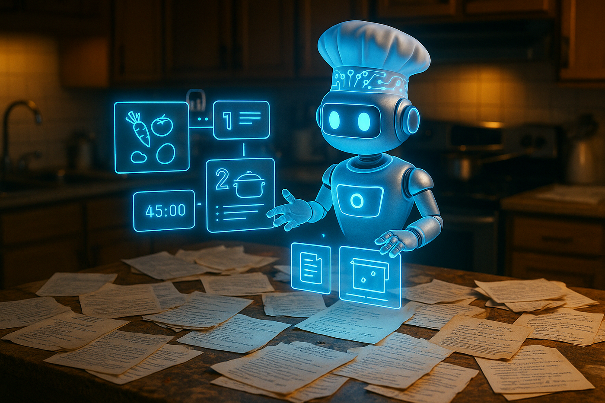

<div align="center">  

# Personal Chef



A web app powered by an AI agent that suggests recipes based on the ingredients
you have at home. Tell it what you've got (or upload a **photo**) and it returns
recipe ideas with links, **streamed** in real time and in whatever language you write.

</div>

---

## Features

- 🤖 AI agent (GPT-4o-mini) that searches the web for real recipes.
- 💬 **Streaming** responses, token by token, with a "searching for recipes…" indicator.
- 🖼️ **Multimodal** input: describe your ingredients by text or upload photos.
- 🗂️ Multiple conversations with a sidebar (create / switch / delete).
- 💾 Chat history stored in `localStorage`, **auto-deleted after 12h** of inactivity.
- 🎨 Clean UI with a collapsible sidebar.

---

🛠️ Tech Stack

### Backend
- **Python 3.12**
- **FastAPI** — API and streaming responses (NDJSON)
- **LangChain** (`create_agent`) + **LangGraph** — agent orchestration
- **OpenAI GPT-4o-mini** — language model (text + vision)
- **Tavily** — web search tool
- **Uvicorn** — ASGI server

### Frontend
- **Next.js** (App Router) + **React** + **TypeScript**
- **react-markdown** + **remark-gfm** — recipe rendering
- **Plain CSS** — styling
- **localStorage** — history persistence with TTL

---

## 🚀 Getting Started
> You'll need **two terminals**: one for the backend and one for the frontend.
### 1) Backend
```bash
cd backend
# create and activate a virtual environment
python -m venv .venv
source .venv/bin/activate          # Windows: .venv\Scripts\activate
# install dependencies
pip install -r requirements.txt
```

Create a backend/.env file with your keys:

OPENAI_API_KEY=sk-...  
TAVILY_API_KEY=tvly-...  
Start the server:

```
uvicorn main:app --reload --port 8000
```
The API runs at http://localhost:8000   
(docs at http://localhost:8000/docs).

2) Frontend
```
cd frontend
npm install
```
Create a frontend/.env.local file:

NEXT_PUBLIC_API_URL=http://localhost:8000
Start the app:
```
npm run dev
```
Open http://localhost:3000 